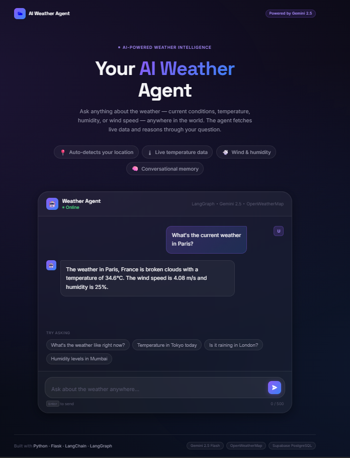
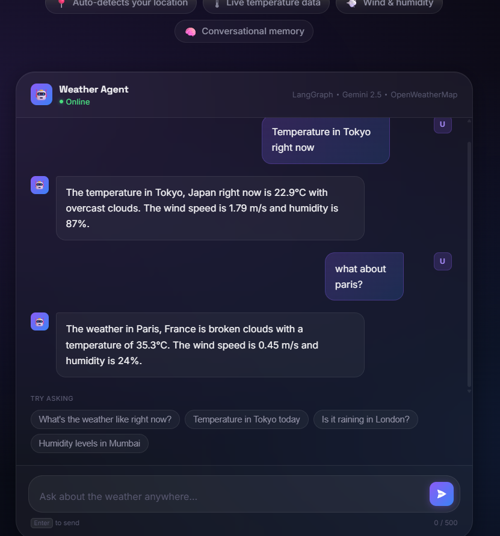
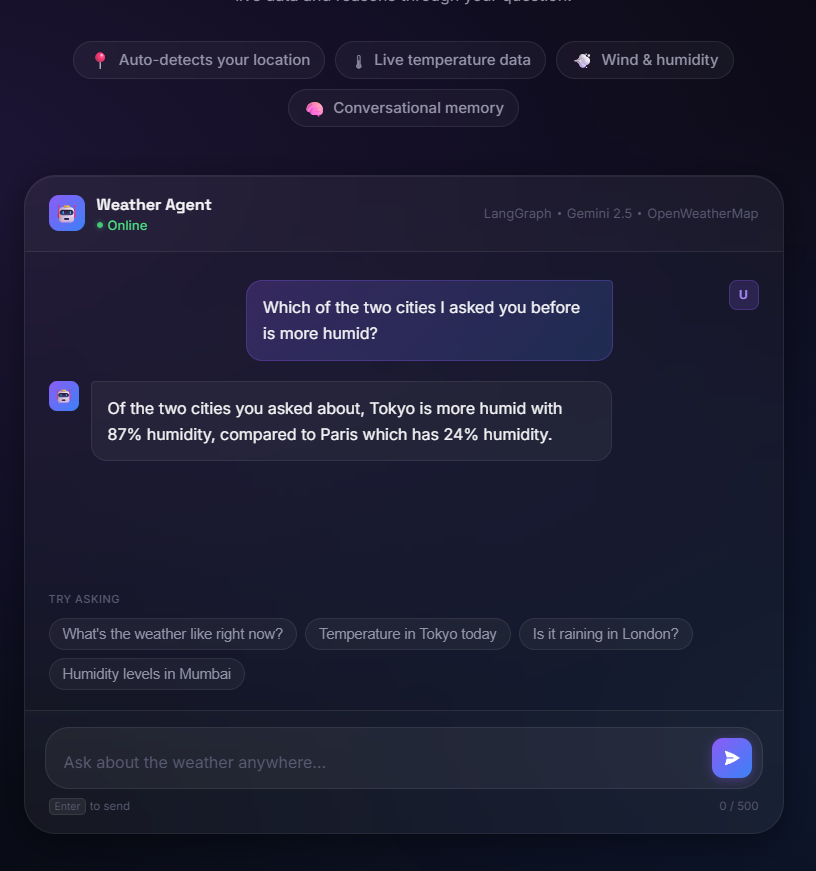

# AI Weather Agent

An AI agent built with LangChain and Google's Gemini model that can retrieve real-time weather information using OpenWeatherMap API. The agent uses tool calling to determine when to fetch weather data and can automatically detect the user's location when no city is specified.

## Features

- Web-based chat interface built with Flask
- Persistent conversation memory using LangGraph and Supabase
- Automatic location detection using IP geolocation
- Real-time weather retrieval using OpenWeatherMap
- AI-powered tool calling with Gemini 2.5 Flash
- Support for follow-up questions using conversation context
- Dynamic temperature unit selection (Celsius/Fahrenheit)

## How It Works

The application uses two tools:

### get_weather(city)

Retrieves live weather data for a specified city using the OpenWeatherMap API.

### get_location()

Determines the user's approximate location through IP-based geolocation.

The AI agent decides which tool(s) to use based on the user's query.

Examples:

- "What's the weather in Charlotte?"
  - Calls `get_weather("Charlotte")`

- "What's the weather today?"
  - Calls `get_location()`
  - Calls `get_weather(location)`
    
## Architecture

```text
User
 │
 ▼
Flask Web Interface
 │
 ▼
LangChain Agent
 │
 ├── get_weather()
 │       ▼
 │   OpenWeatherMap API
 │
 └── get_location()
         ▼
        IPAPI
 │
 ▼
Gemini 2.5 Flash
 │
 ▼
LangGraph Memory
 │
 ▼
Supabase PostgreSQL
```
## Screenshots

### Weather Query with Follow-up Conversation


### Memory Demo Picture 1


### Persistent Memory After Restart


## Tech Stack

- Python
- LangChain
- LangGraph
- Google Gemini 2.5 Flash
- OpenWeatherMap API
- IPAPI Geolocation API
- PostgreSQL
- Supabase
- Requests
- Python Dotenv
- Flask
  
## Dependencies

The project uses the following core packages:

- langchain
- langchain-google-genai
- langgraph
- langgraph-checkpoint-postgres
- flask
- requests
- python-dotenv
- psycopg[binary]

  
## Project Structure

```text
ai-weather-agent/
│
├── app.py
├── main_agent.py
├── requirements.txt
├── .env.example
├── .gitignore
├── README.md
│
├── templates/
│   └── chat.html
│
└── screenshots/
    ├── weather-query.png
    ├── memory-demo-pt-1.png
    └── memory-demo-pt-2.png
```

## Installation

1. Clone the repository

```bash
git clone https://github.com/dhvani-vora/ai-weather-agent
```

2. Install dependencies

```bash
pip install -r requirements.txt
```

3. Create a `.env` file

```env
GOOGLE_API_KEY=your_google_api_key
OPEN_WEATHER_API_KEY=your_openweather_api_key
SUPABASE_DB_URI=your_supabase_connection_string
FLASK_SECRET_KEY=your_secret_key
```

4. Run the application

```bash
python app.py
```
5. Open
```
http://127.0.0.1:5000
```
## Example Usage

```text
Enter your query here:
What is the weather in New York?
```

Output:

```text
The weather in New York is sunny with a temperature of 25°C. The wind speed is 3.5 m/s and the humidity is 60%.
```

## Conversation Memory

The agent uses LangGraph's PostgresSaver with a PostgreSQL database hosted on Supabase.

Conversation history is stored persistently, allowing the agent to remember previous messages even after the application is restarted.

Example:

```text
User: What's the weather in Paris?
Agent: It is 32°C and partly cloudy.

[Application closes]

User: Which city did we discuss earlier?
Agent: We previously discussed Paris.
```
## Learning Outcomes

Through this project, I learned:

- Building AI agents with LangChain
- Tool calling and function execution
- Managing conversation memory
- Using LangGraph checkpointers
- Working with PostgreSQL databases
- Integrating Supabase with Python
- Designing multi-step AI workflows

## Future Improvements

- Browser GPS location support
- Docker containerization
- Cloud deployment
- Streaming responses
- Voice-enabled weather assistant
- Multi-user conversation support

## Version History

### v1.0
- Gemini-powered weather agent
- Tool calling with OpenWeatherMap API
- Automatic location detection

### v1.1
- Persistent conversation memory
- PostgreSQL database integration
- Supabase cloud storage
- Conversation history across sessions

### v1.2
- Flask web chat interface
- Session-based chat history display
- Styled conversational UI
- Integration of LangGraph memory with web application
- Support for multi-message browser conversations
